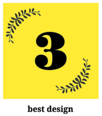

COVER.BOUTIQUE is a web application to create DIY inlays for transparent smartphone cases. It runs in browsers on all devices and can be installed as a PWA (progressive web app). COVER.BOUTIQUE is IIIF compatible and extensible.

COVER.BOUTIQUE was awarded with "BEST DESIGN" in Germanys premier cultural hackathon Coding da Vinci
https://codingdavinci.de/events/sued/

* Idee: Mathilda Seige
* Programmierung: Leander Seige
* Smartphone Templates: Leander Seige, Mathilda Seige, Robin Kocaurek

BEWARE! ANTLITZ.NINJA is a hack, it is not intended to demonstrate exemplary programming, it was built to work.

### Other Resources

* Font Awesome, CC-BY 4.0, https://fontawesome.com/license/free
* Ajax Loader GIF, WTFPL, http://www.ajaxload.info/
* Logo Font: Sacramento by Brian J. Bonislawsky, Open Font License, Source: https://fonts.google.com/specimen/Sacramento
