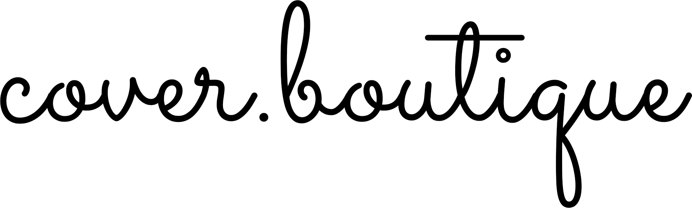
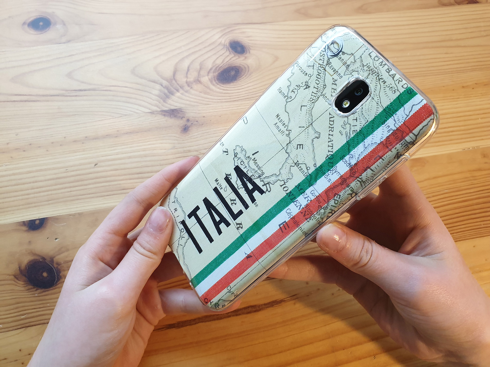

COVER.BOUTIQUE is web application to create DIY self made inlays for transparent smartphone cases. COVER.BOUTIQUE is IIIF compatible.

* Idee: Mathilda Seige
* Programmierung: Leander Seige
* Smartphone Templates: Leander Seige, Mathilda Seige, Robin Kocaurek

### Other Resources

* Font Awesome, CC-BY 4.0, https://fontawesome.com/license/free
* Ajax Loader GIF, WTFPL, http://www.ajaxload.info/
* Logo Font: Sacramento by Brian J. Bonislawsky, Open Font License, Source: https://fonts.google.com/specimen/Sacramento
